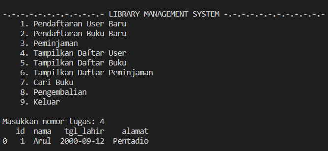

# Library Management System (LMS) Sederhana

Sebuah LMS sederhana yang terhubung dengan database berbasis MySQL.

## Cara Kerja

Tugas yang tersedia yaitu:

1. Pendaftaran User Baru
2. Pendaftaran Buku Baru
3. Peminjaman
4. Tampilkan Daftar User
5. Tampilkan Daftar Buku
6. Tampilkan Daftar Peminjaman
7. Cari Buku
8. Pengembalian
9. Keluar

## Cara Penggunaan Program

Berikut ini adalah panduan menjalankan program.

- Pastikan MySQL terinstall
- Jalankan `simpleLMS.sql` untuk membuat database yang diperlukan
- Pada variabel yang terletak pada bagian atas fungsi `main()`, isi data:
  - username,
  - password, dan
  - host
- Jalankan `simpleLMS.py`

## Hasil Kasus Uji

### Pendaftaran User

#### Menginputkan data user

#### Menampilkan data user setelah insert

### Pendaftaran Buku

#### Menginputkan data buku

#### Menampilkan data buku setelah insert

### Peminjaman

#### Menginputkan data peminjaman

#### Menampilkan data peminjaman setelah insert

#### Menampilkan data buku setelah peminjaman

### Pengembalian

#### Menginputkan data pengembalian

#### Menampilkan data peminjaman setelah pengembalian

#### Menampilkan data buku setelah pengembalian

### Pencarian Buku

## Saran Perbaikan

Perbaikan yang dapat dilakukan antara lain:

- menambahkan tugas baru seperti menghapus record
- menambahkan prompt untuk meminta username dan password MySQL
- mempercantik interface.
